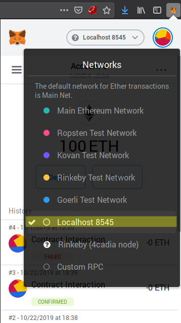

# JNS

Decentralized Name Service for the Web 3.0.

## Overview

JNS builds upon traditional DNS architecture, allowing users to register TLDs and domains that are currently stored in a [Ethereum](https://ethereum.org/) smart contract.

There are some ongoing research aiming to review such architecture to create a standard that is more suited to the Web 3.0. For more details, see [EIP 2193](https://eips.ethereum.org/EIPS/eip-2193).

While JNS is open to comply to new architectural standards that may arise, at the moment we decided to stick to the current DNS standard to ease user adoption, even though it has some known issues.

## Functionalities

To know how to use this application, please refer to the [User Guide](./USER-GUIDE.md).

### 1. Register TLDs

- Users **can** register any TLD they want. 
    - Only restrictions is the length of the name being registered.
- By default TLD registration expires after 1 year.

### 2. Renew TLDs

- Users **may** renew a TLD they own.
    - Expiration date will always be incremented 1 year at a time.

### 3. Transfer TLDs

- A user can transfer the ownership of a previously purchased TLD to any other valid Ethereum address.


### 4. Register Domains

- Users **can** register any domain they want.
    - Only restriction is the length of the name being registered.
- A domain **must** always be registered under a previously registered TLD.
- A domain **must** be linked to a content
    - Currently the only type of content supported is an [IPFS](https://ipfs.io/) hash.
- By default domain registration expires after 1 year.

### 5. Renew Domains

- Users **may** renew a domain they own.
    - Expiration date will always be incremented 1 year at a time.

### 6. Transfer TLDs

- A user can transfer the ownership of a previously purchased domain to any other valid Ethereum address.

## Architectural Overview

This project is composed of 3 related, but independent packages:

- `smartcontract`: contains the code of the smart contract which define the business rules and primarily governs JNS.
- `core`: acts as a middleware between the UI and the smart contract, providing facilities like validation, to prevent loss of funds due to bad interactions with the contract.
- `dapp`: is a sample UI implemented as an SPA which enables users to interact with JNS.

## Run the Application

### Pre-requisites

- Yarn: `>= 1.19.0`
- Node: `>= 10.0.0 <12.0.0`
- Metamask: `>=7.3.1` (browser extension to interact with the dapp)

### Clone the Project

```
git clone https://github.com/4cadia-foundation/jns
```

### Install Dependencies

Inside the main folder of the project:
```
yarn install
```

### 1. Smart Contract Interaction

JNS smart contract is currently deployed to the Rinkeby Test Network at address [0x3975F6345aF041cd858e9988b71EDC269B32337C](https://rinkeby.etherscan.io/address/0x3975F6345aF041cd858e9988b71EDC269B32337C). If you want to use this version, you can skip this section.

To deploy a local version of the smart contract, you will need to install either [`ganche-cli`](https://www.npmjs.com/package/ganache-cli) or [`geth`](https://geth.ethereum.org/downloads/).

<details>
<summary>Click here to see how</summary>
<div>

#### 1a. Usage with `ganache-cli`

It is important to set `1234` as `networkId` in order to make it work properly.

```sh
ganache-cli -i 1234
```

Alternatively, you can pass your Metamask mnemonic key to have you default accounts already populated with ether:

```sh
ganache-cli -i 1234 -m <MNEMONIC_KEY>
```

#### 1b. Usage with `geth`

The recommended way to connect via geth is through a private development network:

```sh
geth --dev --datadir <DATA_DIRECTORY> --networkid 1234 --rpc
# e.g.: geth --dev --datadir /tmp/geth --networkid 1234 --rpc
``` 

For more details, please refer to the [geth docs](https://github.com/ethereum/go-ethereum/wiki/Private-network).

#### Deploy a Local Contract

From the repository root:
```
cd packages/smartcontract
yarn deploy --network local
```

#### Set Metamask Network to Local

In your Metamask browser extension, set the default local network `localhost:8545`:



</div>
</details>

### 2. Compile the Core Package

From the repository root:

```
cd packages/core
yarn build
```

### 3. Run the Dapp

From the repository root:

```
cd packages/dapp
yarn dev
```

This will start a `webpack-dev-server` instance.

Alternatively, if you want to use the production build, instead of `yarn dev`, run:

```
yarn build
```

After that, the production build will be available at the `dist/` directory. Then you can use something like [`http-server`](https://www.npmjs.com/package/http-server):

```sh
http-server dist/
```

In both cases, the dapp will probably be available at:

```
http://localhost:8080
```

**IMPORTANT:** verify if your Metamask is connected to the correct network (Rinkeby or your local one);

#### Troubleshooting

If port `8080` is busy, then both approaches will try to make it available at port `8081`. If this port is still unavailable, then `8082` and so on.

### Run tests

Currently there are tests only in the `smartcontract` package:

```
cd packages/smartcontract
yarn test
```

## Docker

- [ ] TODO: Create a docker image to ease project setup

## TODO List

- [ ] Make it usable
    - Should we keep using browser extensions?
    - Should we implement a new browser with native support?
- [ ] Allow users to change the content related to a domain. (_in progress_)
- [ ] Implement full DNS funcionalities, with support for some commonly used [DNS Record Types](https://en.wikipedia.org/wiki/List_of_DNS_record_types).
    - The currently implemented funcionality allows only for a single entry, which works roughly as `A` record whose target is the IPFS hash.
- [ ] Introduce monetization policies
    - How much charge for a TLD or domain registration?
    - How much charge for renovation?
    - Should a TLD owner be able to charge a fee for each domain registered under it? How much could it be?
- [ ] Add some Game Theory bytes
    - How to prevent first runners from hoarding TLDs and domains?
    - Should we hold auctions for short names?
- [ ] Make it ecosystem friendly
    - Should we blacklist `.eth` TLD to prevent name collisions with [ENS](https://ens.domains/)?
- [ ] Make it compliant with international intelectual property laws
    - How to prevent users from registering TLDs and domains linked to registered trademarks? Should we even bother?

## Previous Work in the Wild

- [ENS](https://ens.domains/)
- [Unstoppable Domains](https://unstoppabledomains.com/)

### JNS vs ENS

TODO.

### JNS vs Unstoppable Domains

TODO.
